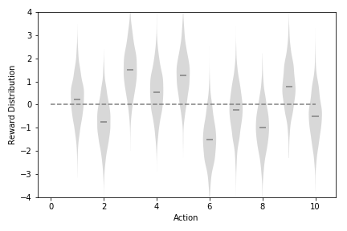
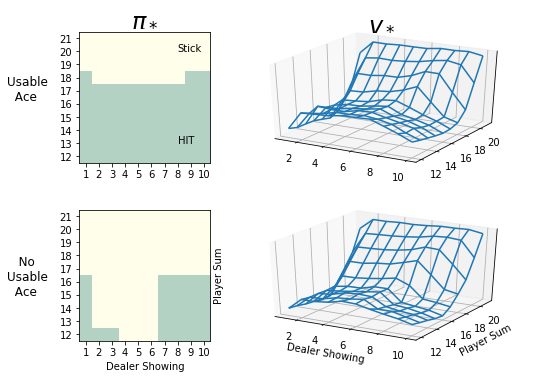
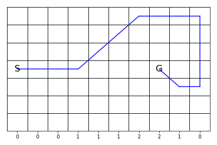
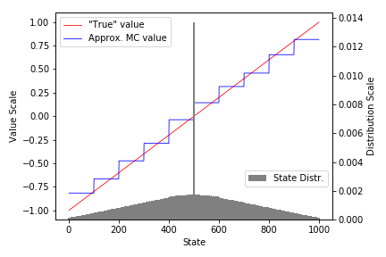
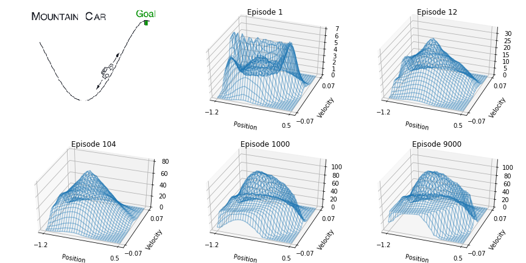

<h1> RL Sketchpad </h1>

Implementations of various RL Algorithms

Contents:
<ul>
  <li><a href="#rl-introduction">Reinforcement Learning: An Introduction</a> (2nd ed, 2018) by Sutton and Barto</li>
  <li><a href="#ucl-course-on-rl">UCL Course on RL</a> (2016) YouTube lectures by David Silver</li>
  <li><a href="#mini-posts">Mini Posts</a> - other algorithms</li>
</ul>

 

<h2 id="rl-introduction"> Reinforcement Learning: An Introduction (2nd ed, 2018) by Sutton and Barto </h2>

Implementation of selected algorithms from the book. I tried to make code snippets minimal and faithful to the book.

<table>
  <tr>
    <td> Part I: Tabular Solution Methods </td>
    <td> </td>
  </tr>
 
  <tr>
    <td>
      

        Chapter 2: Multi-armed Bandits
        <ul>
          <li> 2.4: <a href="https://marcinbogdanski.github.io/rl-sketchpad/RL_An_Introduction_2018/0204_Simple_Bandit.html">Simple Bandit</a> - fig. 2.1, 2.2 </li>
          <li> 2.6: <a href="https://marcinbogdanski.github.io/rl-sketchpad/RL_An_Introduction_2018/0206_Tracking_Bandit.html"> Tracking Bandit</a> - fig. 2.3 </li>
        </ul>
      

    </td>
    <td style="border-color: white;">
      
    </td>
  </tr>

  <tr>
    <td>
      

        Chapter 4: Dynamic Programming
        <ul>
          <li> 4.1: <a href="https://marcinbogdanski.github.io/rl-sketchpad/RL_An_Introduction_2018/0401_Iterative_Policy_Evaluation.html">Iterative Policy Evaluation</a> - FrozenLake-v0 <!--gw 4.1 --> </li>
          <li> 4.3: <a href="https://marcinbogdanski.github.io/rl-sketchpad/RL_An_Introduction_2018/0403_Policy_Iteration.html">Policy Iteration</a> - FrozenLake-v0 <!--gw, car-re, e4.2 f4.2 --> </li>
          <li> 4.4: <a href="https://marcinbogdanski.github.io/rl-sketchpad/RL_An_Introduction_2018/0404_Value_Iteration.html">Value Iteration</a> - FrozenLake-v0 <!-- gambler problem, fig 4.3 --> </li>
        </ul>
      

    </td>
    <td style="border-color: white;">
      
    </td>
  </tr>
  
  
  <tr>
    <td>
      

        Chapter 5: Monte Carlo Methods
        <ul>
          <li> 5.1: <a href="https://marcinbogdanski.github.io/rl-sketchpad/RL_An_Introduction_2018/0501_First_Visit_MC_Prediction.html">First-Visit MC Prediction</a> - Blackjack-v0, fig. 5.1 </li>
          <li> 5.3: <a href="https://marcinbogdanski.github.io/rl-sketchpad/RL_An_Introduction_2018/0503_Monte_Carlo_ES_Control.html">Monte Carlo ES Control</a> - Blackjack-v0, fig. 5.2 </li>
          <li> 5.4: <a href="https://marcinbogdanski.github.io/rl-sketchpad/RL_An_Introduction_2018/0504_On_Policy_First_Visit_MC_Control.html">On-Policy First-Visit MC Control</a> - Blackjack-v0 </li>
        </ul>
      

    </td>
    <td style="border-color: white;">
      
    </td>
  </tr>
  
  <tr>
    <td>
      

        Chapter 6: Temporal-Difference Learning
        <ul>
          <li> 6.1: <a href="https://marcinbogdanski.github.io/rl-sketchpad/RL_An_Introduction_2018/0601_TD_Prediction.html">TD Prediction</a> - Blackjack-v0, example 6.2 
              <ul><li> Also: <a href="https://marcinbogdanski.github.io/rl-sketchpad/RL_An_Introduction_2018/0601_TD_Prediction.html">Running-Mean MC Prediction</a> </li></ul>
          </li>
          <li> 6.4: <a href="https://marcinbogdanski.github.io/rl-sketchpad/RL_An_Introduction_2018/0604_Sarsa.html">Sarsa</a> - WindyGridworld, example 6.5 </li>
          <li> 6.5: <a href="https://marcinbogdanski.github.io/rl-sketchpad/RL_An_Introduction_2018/0605_Q_Learning.html">Q-Learning</a> - CliffWalking, example 6.6 </li>
        </ul>
      

    </td>
    <td style="border-color: white;">
      
    </td>
  </tr>

  <tr>
    <td> Part II: Approximate Solution Methods </td>
    <td> </td>
  </tr>
  
  <tr>
    <td>
      

        Chapter 9: On-Policy Prediction with Approximation
        <ul>
          <li> 9.3a: <a href="https://marcinbogdanski.github.io/rl-sketchpad/RL_An_Introduction_2018/0903a_Gradient_MC.html">Gradient Monte Carlo</a> - example 9.1, fig. 9.1 <!-- calc "true" --> </li>
          <li> 9.3b: <a href="https://marcinbogdanski.github.io/rl-sketchpad/RL_An_Introduction_2018/0903b_Semi_Gradient_TD.html">Semi-Gradient TD</a> - example 9.2, fig. 9.2 (left) </li>
          <li> 9.5a: <a href="https://marcinbogdanski.github.io/rl-sketchpad/RL_An_Introduction_2018/0905a_LM_Poly_Fourier.html">Linear Models - Polynomial and Fourier Bases</a> - fig. 9.5 </li>
          <li> 9.5b: <a href="https://marcinbogdanski.github.io/rl-sketchpad/RL_An_Introduction_2018/0905b_LM_Agg_Tile.html">Linear Models - Tile Coding</a> - fig. 9.10 </li>
          <li> 9.7: <a href="https://marcinbogdanski.github.io/rl-sketchpad/RL_An_Introduction_2018/0907_ANN.html">Neural Network with Memory Reply</a> </li>
        </ul>
      

    </td>
    <td style="border-color: white;">
      
    </td>
  </tr>
  
  <tr>
    <td>
      

        Chapter 10: On-Policy Control with Approximation
        <ul>
          <li> 10.1: <a href="https://marcinbogdanski.github.io/rl-sketchpad/RL_An_Introduction_2018/1001_Episodic_Semi_Gradient_Sarsa.html">Episodic Semi-Gradient Sarsa</a> - MountainCar, fig 10.1, 10.2 </li>
        </ul>
      

    </td>
    <td style="border-color: white;">
      
    </td>
  </tr>

<!--
  <tr>
    <td>
      

        Chapter Chapter
        <ul>
          <li>  </li>
          <li>  </li>
        </ul>
      

    </td>
    <td style="border-color: white;">
      
    </td>
  </tr>
-->
  
</table>

<!--
## Reinforcement Learning
### Reinforcement Learning: An Introduction (2nd ed, 2018) by Sutton and Barto
* Part I: Tabular Solution Methods
  * Chapter 2: Multi-armed Bandits
    * 2.4: [Simple Bandit](RL_An_Introduction_2018/0204_Simple_Bandit.ipynb) - fig. 2.1, 2.2
    * 2.6: [Tracking Bandit](RL_An_Introduction_2018/0206_Tracking_Bandit.ipynb) - fig. 2.3
  * Chapter 4: Dynamic Programming
    * 4.1: [Iterative Policy Evaluation](RL_An_Introduction_2018/0401_Iterative_Policy_Evaluation.ipynb) - FrozenLake-v0 
    * 4.3: [Policy Iteration](RL_An_Introduction_2018/0403_Policy_Iteration.ipynb) - FrozenLake-v0 
    * 4.4: [Value Iteration](RL_An_Introduction_2018/0404_Value_Iteration.ipynb) - FrozenLake-v0 
  * Chapter 5: Monte Carlo Methods
    * 5.1: [First-Visit MC Prediction](RL_An_Introduction_2018/0501_First_Visit_MC_Prediction.ipynb) - Blackjack-v0, fig. 5.1
    * 5.3: [Monte Carlo ES Control](RL_An_Introduction_2018/0503_Monte_Carlo_ES_Control.ipynb) - Blackjack-v0, fig. 5.2
    * 5.4: [On-Policy First-Visit MC Control](RL_An_Introduction_2018/0504_On_Policy_First_Visit_MC_Control.ipynb) - Blackjack-v0
  * Chapter 6: Temporal-Difference Learning
    * 6.1: [TD Prediction](RL_An_Introduction_2018/0601_TD_Prediction.ipynb) - Blackjack-v0, example 6.2, [Running-Mean MC Prediction](RL_An_Introduction_2018/0601_TD_Prediction.ipynb#Right-figure) alg.
    * 6.4: [Sarsa](RL_An_Introduction_2018/0604_Sarsa.ipynb) - WindyGridworld, example 6.5
    * 6.5: [Q-Learning](RL_An_Introduction_2018/0605_Q_Learning.ipynb) - CliffWalking, example 6.6
* Part II: Approximate Solution Methods
  * Chapter 9: On-Policy Prediction with Approximation
    * 9.3a: [Gradient Monte Carlo](RL_An_Introduction_2018/0903a_Gradient_MC.ipynb) - example 9.1, fig. 9.1 
    * 9.3b: [Semi-Gradient TD](RL_An_Introduction_2018/0903b_Semi_Gradient_TD.ipynb) - example 9.2, fig. 9.2 (left)
    * 9.5a: [Linear Models - Polynomial and Fourier Bases](RL_An_Introduction_2018/0905a_LM_Poly_Fourier.ipynb) - fig. 9.5
    * 9.5b: [Linear Models - Tile Coding](RL_An_Introduction_2018/0905b_LM_Tile_Coding.ipynb) - fig. 9.10
  * Chapter 10: On-Policy Control with Approximation
    * 10.1: [Episodic Semi-Gradient Sarsa](RL_An_Introduction_2018/1001_Episodic_Semi_Gradient_Sarsa.ipynb) - MountainCar, fig 10.1, 10.2
-->

<!-- 4.1    gw 4.1 -->
<!-- 4.3    gw, car-re, e4.2 f4.2 -->
<!-- 4.4    gambler problem, fig 4.3 -->
<!-- 9.3a   calc "true" -->

<!--* Chapter 1: Introduction -->
<!--  * Section 1.5: [Tic-Tac-Toe]() -->

<!--  * Section 2.7: [UCB Bandit]() - plot figure 2.4 -->
<!--  * Section 2.8: [Gradient Bandit]() - plot figure 2.5 -->
<!--  * Section 2.10: [Bandit Parameter Study]() - plot figure 2.6 -->

<!--  * Section 5.6: [Off-Policy MC Prediction](RL_An_Introduction_2018/0506_Off_Policy_MC_Prediction.ipynb) - fig. 5.3, 5.4-->
<!--  * Section 5.7: [Off-Policy MC Control](RL_An_Introduction_2018/0507_Off_Policy_MC_Control.ipynb) -->
<!--  * Section 5.8*: discounting aware IS -->
<!--  * Section 5.9*: per-decision IS -->

<!--  * Section 6.3: batch TD and MC - figure 6.2 -->
<!--  * Section 6.6: Expected Sarsa - figure 6.3, compare corridor? -->
<!--  * Section 6.7: Double Q-Learning - example 6.5 -->

<!--  * Section 7.1: N-Step TD Prediction - figure 7.2 -->
<!--  * Section 7.2: N-Step Sarsa - figure 7.4, +compare corridor? -->
<!--  * Section 7.3: Off-Policy N-Step Sarsa - importance sampling -->
<!--  * Section 7.5: N-Step Tree Backup -->
<!--  * Section 7.6: N-Step Q(phi?) - unifying algorithm -->

<!--  * Section 8.1: Random-Sample One-Step Tabular Q-Planning -->
<!--  * Section 8.2: Tabular Dyna-Q - dyna maze, fig 8.2, 8.3 -->
<!--  * Section 8.3: Fig 8.4, 8.5 (model is wrong) -->
<!--  * Section 8.4: Prioritized sweeping - example 8.4 -->
<!--  * Section 8.5: expected vs sample updates - figure 8.7 -->
<!--  * Section 8.6: trajectorry sampling - figure 8.8 -->
<!--  * Section 8.8, 8.9, 8.10, 8.11: planning at decision time - .. - MCTS -->

<!-- * Section 9.4 [N-Step Semi-Gradient TD]() - fig 9.2 (right)? -->
<!-- * Section 9.5 [Coarse Coding]() - square wave, fig 9.8 -->
<!-- * Section 9.8 [Least-Squares TD]() -->

<!-- * Section 10.2: [Semi-Gradient N-Step Sarsa]() - fig 10.3, 10.4 -->
<!-- * Section 10.3: [Differential Semi-Gradient Sarsa]() - avg. reward, fig. 10.5 -->
<!-- * Section 10.3: [Differential Semi-Gradient N-Step Sarsa]() -->

<!-- * Section 11.2* Off-policy divergence, fig 11.2 -->
<!-- * Section 11.7* Gradient-TD Methods fig 11.5 -->
<!-- * Section 11.8* Emphatic-TD Methods fig 11.5 -->

<!-- * Section 12.2: TD(λ) fig 12.3 -->
<!-- * Section 12.5: True Online TD(λ) fig 12.8 -->
<!-- * Section 12.7: Sarsa(λ) and True Online Sarsa(λ) - fig. 12.10, 12.11 -->
<!-- * Section 12.13: fig 12.14 -->

<!-- * Section 13.3: REINFORCE -->
<!-- * Section 13.4: REINFORCE with Baseline -->
<!-- * Section 13.5: One-Step Actor-Critic & Actor-Critic with Eligibility Traces (episodic) -->
<!-- * Section 13.6: Actor-Critic with Eligibility Traces (continuing) -->

<!--
* Linear Functions
  * Buckets
  * Tiles
* On-policy control - mountain car
* average reward [...]
* eligibility traces[...]
* policy gradients [...]
-->

 

<h2 id="ucl-course-on-rl"> UCL Course on RL (2016) Youtube lectures by David Silver </h2>

A bit more in-depth explanation of selected concepts from David Sivler lectures and Sutton and Barto book.

<ul>
  <li>
    Lecture 3 - Dynamic Programming
    <ul>
      <li><a href="https://marcinbogdanski.github.io/rl-sketchpad/UCL_Course_on_RL/Lecture03_DP/DynamicProgramming.html">Dynamic Programming</a> - Iterative Policy Evaluation, Policy Iteration, Value Iteration</li>    
    </ul>
  </li>
  
  <li>
    Lecture 4 - Model Free Prediction
    <ul>
      <li><a href="https://marcinbogdanski.github.io/rl-sketchpad/UCL_Course_on_RL/Lecture04_Pred/ModelFreePrediction_Part1.html">MC and TD Prediction</a></li>
      <li><a href="https://marcinbogdanski.github.io/rl-sketchpad/UCL_Course_on_RL/Lecture04_Pred/ModelFreePrediction_Part2.html">N-Step and TD(λ) Prediction</a> - Forward TD(λ) and Backward TD(λ) with Eligibility Traces</li>    
    </ul>
  </li>
  
  <li>
    Lecture 4 - Model-Free Control
    <ul>
      <li><a href="https://marcinbogdanski.github.io/rl-sketchpad/UCL_Course_on_RL/Lecture05_Ctrl/ModelFreeControl_Part1.html">On-Policy Control</a> - MC, TD, N-Step, Forward TD(λ), Backward TD(λ) with Eligibility Traces</li>
      <li><a href="https://marcinbogdanski.github.io/rl-sketchpad/UCL_Course_on_RL/Lecture05_Ctrl/ModelFreeControl_Part2.html">Off-Policy Control - Expectation Based</a> - Q-Learning, Expected SARSA, Tree Backup</li>
      <li><a href="https://marcinbogdanski.github.io/rl-sketchpad/UCL_Course_on_RL/Lecture05_Ctrl/ModelFreeControl_Part3.html">Off-Policy Control - Importance Sampling</a> - I.S. SARSA, N-Step I.S. SARSA, Off-Policy MC Control</li>
    </ul>
  </li>
</ul>

 

<h2 id="mini-posts"> Mini Posts </h2>

<ul>
  <li><a href="https://marcinbogdanski.github.io/rl-sketchpad/Mini_Posts/ANN_Correlated_Data.html">ANN and Correlated Data</a> - simplest possible example showing why <b>memory reply</b> is necessary</li>
  <li><a href="https://marcinbogdanski.github.io/rl-sketchpad/Mini_Posts/Minimal_TF_Keras.html">Minimal TF Keras</a> - fit sine wave</li>
    
    
</ul>

<!--
%3A  :
%28  (
%29  )
-->

